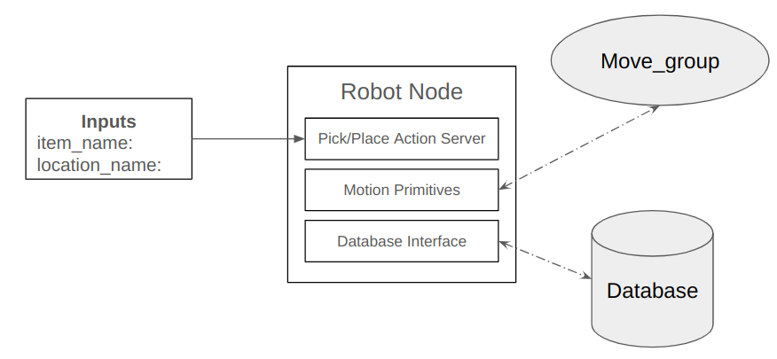
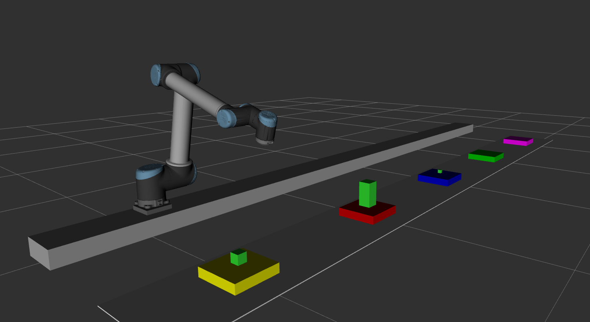
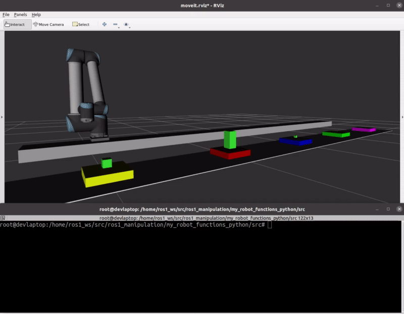
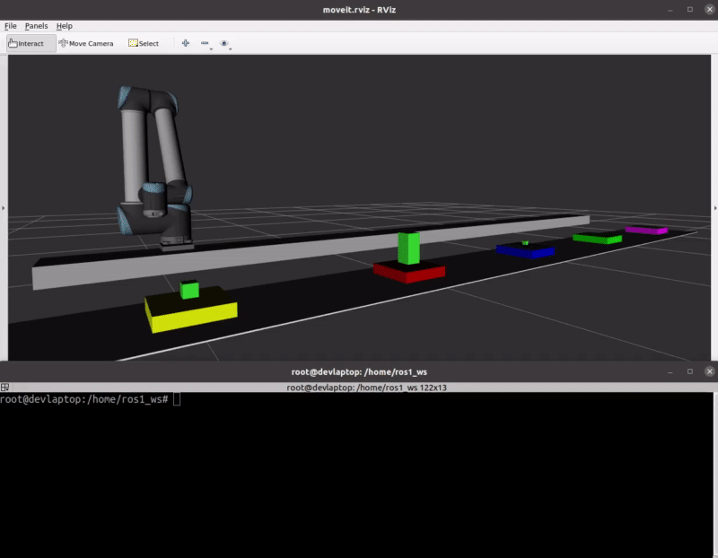
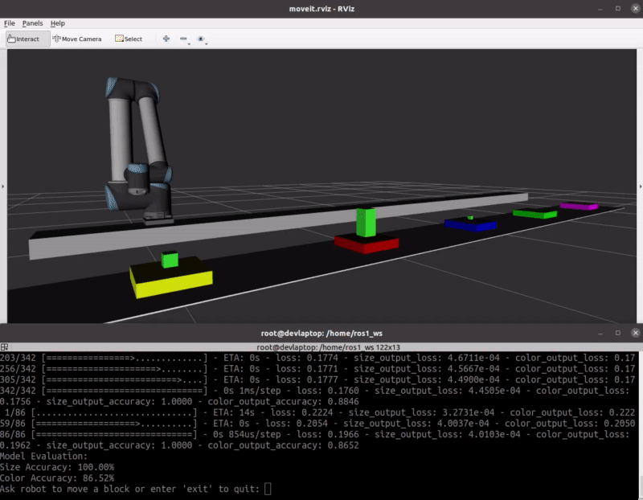

# ROS1 Manipulation Application
This repo demonstrates a ROS1 manipulation stack to enable pick and place tasks from high level commands. At the core of this stack is a pick and place action server that contains pick/place behavior primitives and a database/world model which is used to track world states and automate pick/place parameter inputs. The use of a database/world model allows for the pick and place server to accept `string` based inputs of items to pick, and locations to place the items.



To showcase the capabilities of this action server, this repo demonstrates three ways to interface with the action server:
1. A basic pick and place client that accepts string based inputs of items to pick and locations to place the items.
2. A behavior tree interface where users can easily create pick place sequences from a XML file.
3. An AI pick and place client that accepts nautal language commands such as "move item A to location B"



## Development Env
- Ubuntu 20.04
- ROS Noetic
- Docker

## Docker Install
This project uses docker to install and build the environment. There are two
ways to build this project:
1.) App mode
2.) Dev mode

### App mode
In app mode, one will be able to quickly build the environment and run the provided examples. 
To install and build the app, run the following commands:

```
cd Docker/app
./build_env.sh
./launch_env.sh 
```

This will build and run the docker container. Navigate to /home/ros1_ws in the docker container, and run:

```
source devel/setup.bash
```

Now you are ready to run the demos provided in the Application Demos section. 

### Dev mode
In dev mode, one will be able to build the environment and mount the workspace directory in the local machine to the workspace directory in the docker container. This will allow one to make changes to the code on your local machine, and execute those changes in the docker container. This mode is recommended to those who want to extend or change the code in any way. To install in dev mode, run the following commands:

```
cd Docker/dev
./build_env.sh
./launch_env.sh
```

This will build and run the docker container. Navigate to /home/ros1_ws in the docker container, and run:

```
sudo apt-get update -y
rosdep install --from-paths src --ignore-src -r -y
catkin_make
source devel/setup.bash
```

Now you are ready to run the demos provided in the Application Demos section. Once you successfully run the demos, be sure to commit/save your docker container so you do not need to build the environment again. On your local machine run: 

```
docker ps
```

This will show the available docker images. Find the docker image titled ros_manip_dev and copy the CONTAINER ID, then commit the image with the following command:

```
docker commit CONTAINER ID ros_manip_dev
```
## Application Demos:
First, begin by launching Rviz and Moveit to visualize the robot and the environment.

```
roslaunch my_robot_moveit_config launch_my_robot.launch
```

Then, launch the pick and place action server

```
rosrun my_robot_functions_python robot_actions.py
```

Now you are ready to interface with the robot through the the three provided interfaces.

### Basic Pick and Place API
The pick and place server accepts the following high level commands:

- `object_name`: the name of the object to pick up (large, medium, small)
- `location_name`: the name of the location to place the object (red, blue, green, yellow, purple)

To run the pick and place client, run the following command and pass in the object name you want to pick and the locaiton name where you want to place the object.

```
rosrun my_robot_functions_python pick_place_client.py object="large" location="red"
```
There is also a bash script in my_robot_functions_python that will run the pick and place client. To run the script, run the following command:

```
./pick_place.sh -o large -l red
```


### Behavior Tree Interface
For multiple pick and place tasks, the user can create a behavior tree xml file that contains the pick/place tasks they want to run. There is a provided pick_place behavior tree node that accepts the object name and location name as inputs. The user can create a custom behavior tree xml file that contains the pick/place tasks they want to run.

There is an example behavior tree in my_robot_behavior_trees/bt_xml/pick_place.xml which runs a sequence of pick and place actions. To run the behavior tree, run the following command:

```
roslaunch my_robot_behavior_trees pick_place_seq.launch
```



### AI Pick and Place
For a more natural interaction with the robot, the user can command the robot to pick and place an object through a terminal prompt. An example of a user command is: "pick up the small red block and place it on the blue platform". 

This is enabled by a custom multi-output classification NN model is trained using TensorFlow and Keras, designed to predict two distinct categories based on textual input: size and color. The model is trained on a custom dataset of user commands to give examples of what a user might say to the robot, and learn to predict the object the user wants to pick up and the location the user wants to place the object. The model is located in my_robot_ai/src/model.py. To run the model, run the following command:

```
rosrun my_robot_ai ai_pick_place_client.py
```

The model will prompt the user for input, and then predict the object and location the user wants to pick up and place the object. The model will then run the pick and place client to pick up the object and place it in the desired location.


